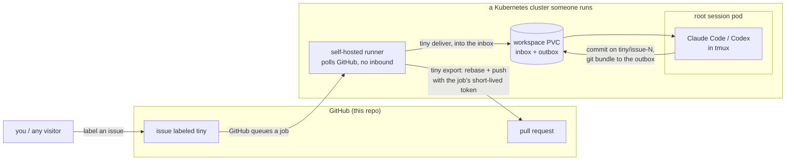

# 🌱 seedling

A tiny link shortener, and the reference playground for
[**tiny**](https://github.com/tiny-systems/tiny) — running the real Claude
Code and Codex CLIs as pods on your own Kubernetes.

This repo exists to show one thing end to end: a labeled GitHub issue
becoming a pull request, opened by an agent that holds no git credentials
and runs in a cluster rather than in CI.

## The loop



Step by step:

1. Someone files an issue and adds the **`tiny`** label.
2. GitHub queues a job. It runs on a **self-hosted runner that lives
   inside the cluster** — the runner polls GitHub outbound, so nothing
   reaches into the cluster from outside. That job pipes the issue into
   the root session's durable inbox with `tiny deliver`.
3. The **root session** — the real agent CLI in a pod with a persistent
   workspace — picks it up, works on branch `tiny/issue-N`, and commits.
   It has **no git credentials**.
4. To send work out, the agent writes a `git bundle` to its outbox. A
   scheduled courier job (`tiny export`, every few minutes, on the same
   in-cluster runner) lifts the bundle out, rebases onto `main`, and
   pushes with the **job's own short-lived token** — which opens the pull
   request and comments back on the issue.

The agent never pushes and never calls the GitHub API. The bundle is the
only thing that leaves the pod.

## Will labeling an issue actually produce a PR?

Only if a tiny cluster is **currently watching this repo**. seedling is a
playground, not an always-on hosted service — there is no agent sitting
here 24/7 waiting for your issue. So:

- **Proof it works:** [pull request #2](https://github.com/tiny-systems/seedling/pull/2)
  was produced exactly this way, from a labeled issue. It is real and
  merged; you can read the diff.
- **To watch it live:** be the cluster. Point your own tiny at this repo
  (or a fork) and label an issue — the
  [5-minute kind quickstart](https://tinysystems.io/docs/quickstart-kind/)
  gets you there on a laptop, and
  [the GitHub-loop docs](https://tinysystems.io/docs/github-loop/) carry
  the workflow file this repo uses ([`.github/workflows/tiny.yml`](.github/workflows/tiny.yml)).

## The app itself

```sh
go run .                                  # listens on :8080
curl -X POST -d url=https://example.com localhost:8080/shorten
curl -i localhost:8080/s1                 # 302 -> example.com
```

In-memory store, no persistence, no dedup, no custom codes — on purpose.
Every missing feature is an issue waiting for a label, and a place for an
agent to prove itself.

MIT.
